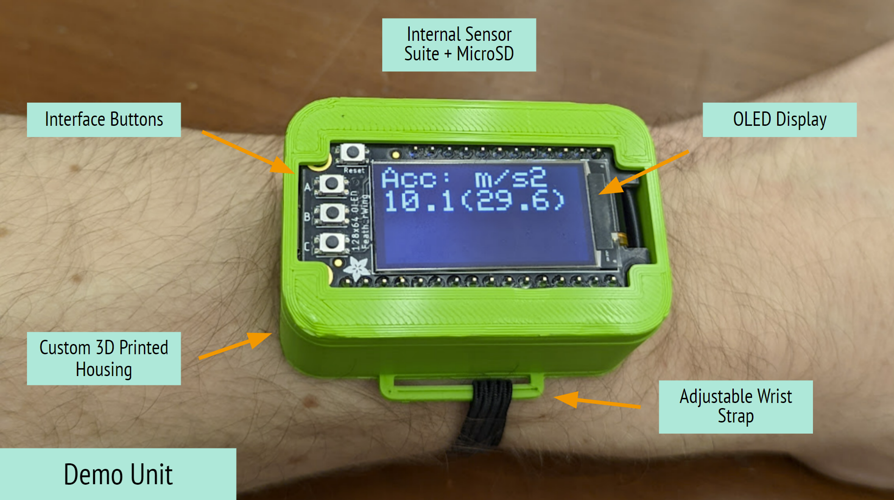
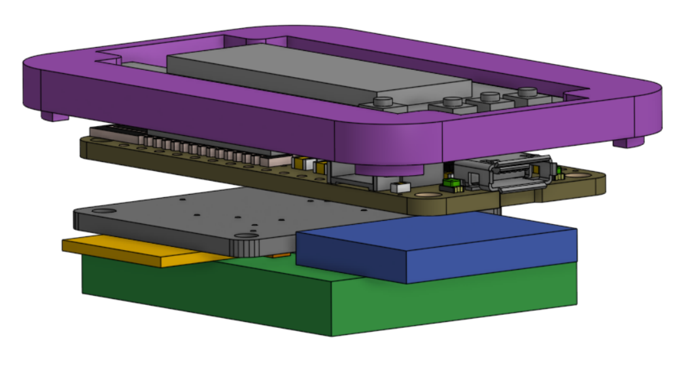
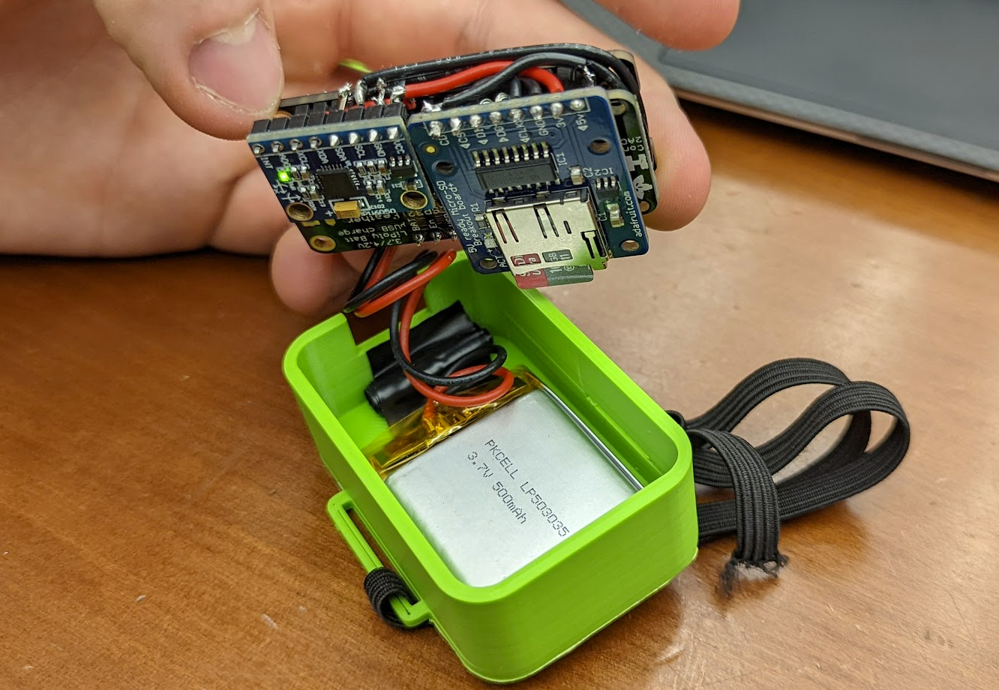
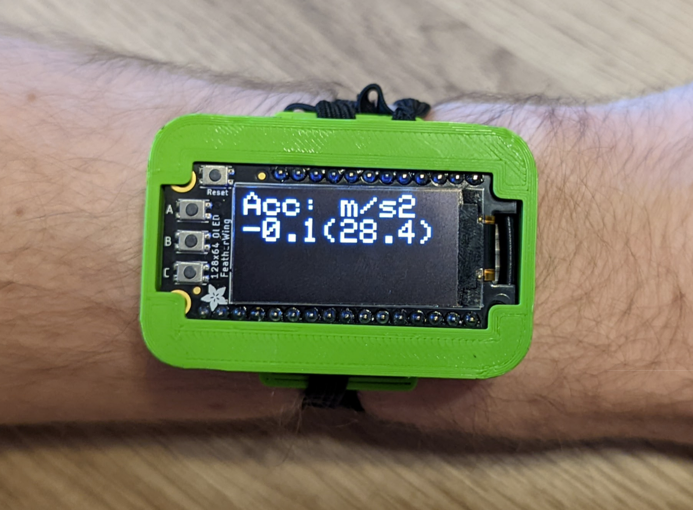
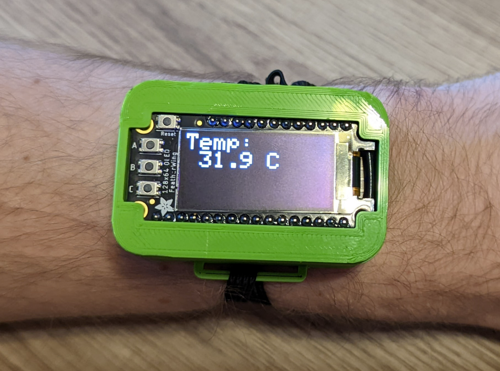
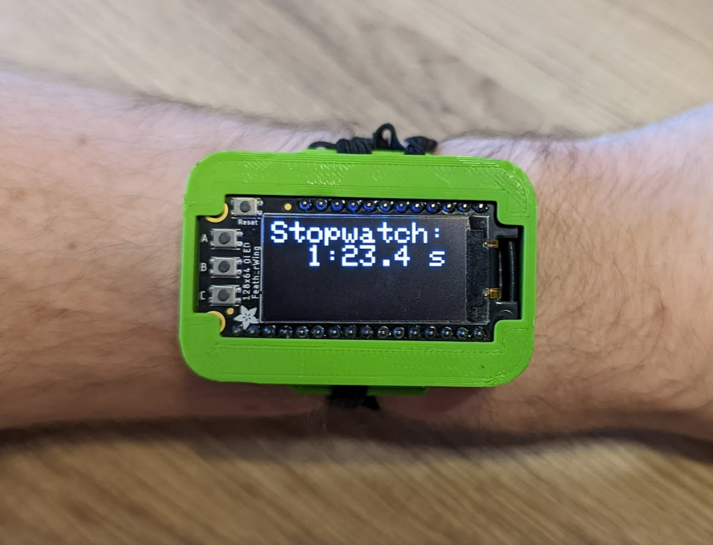
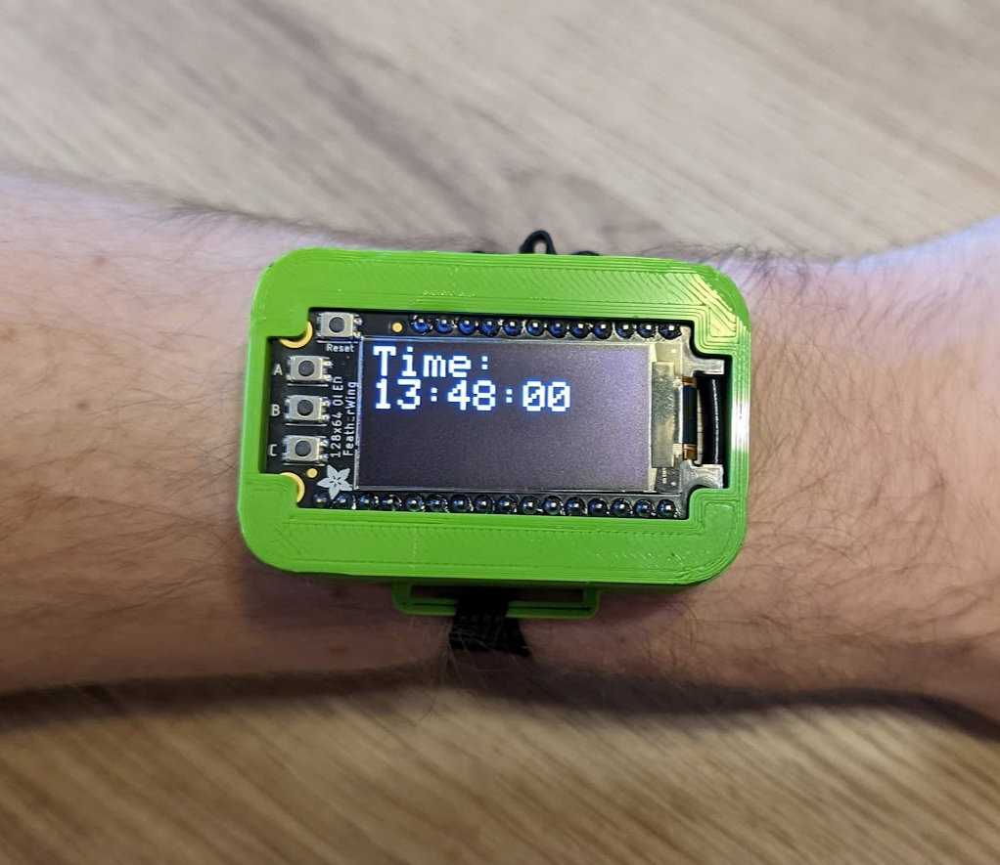
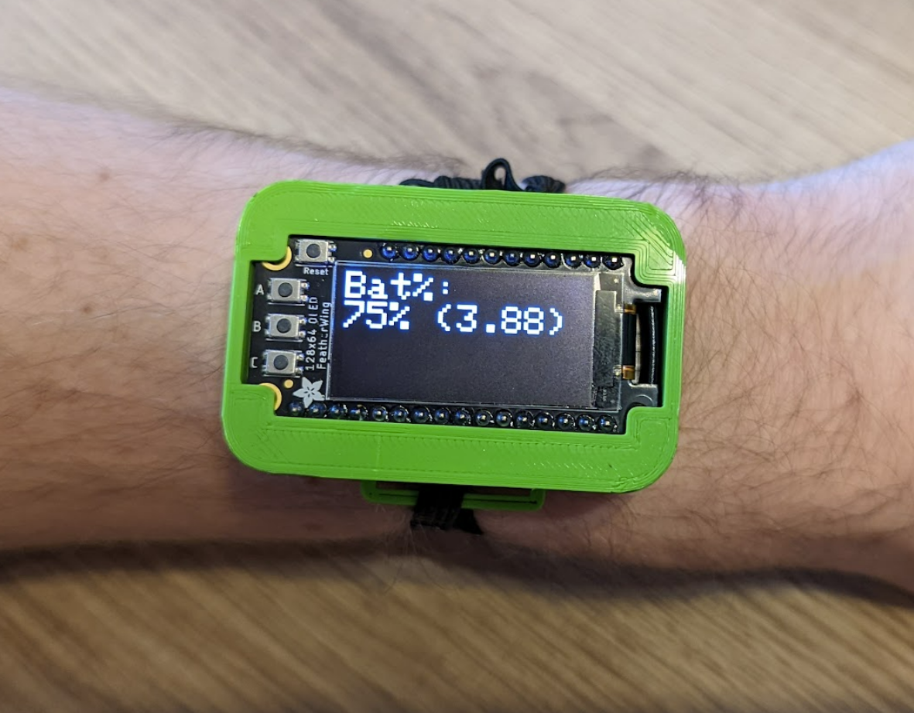
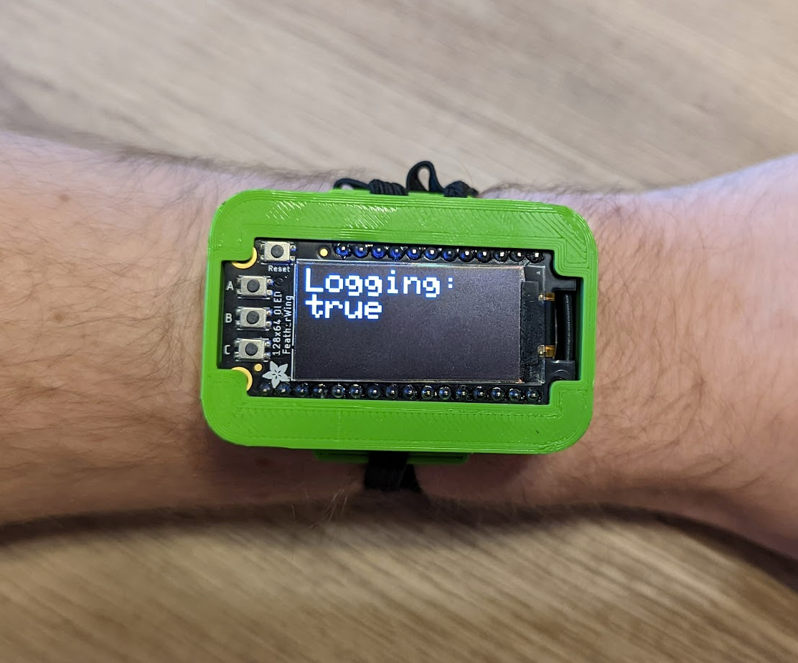
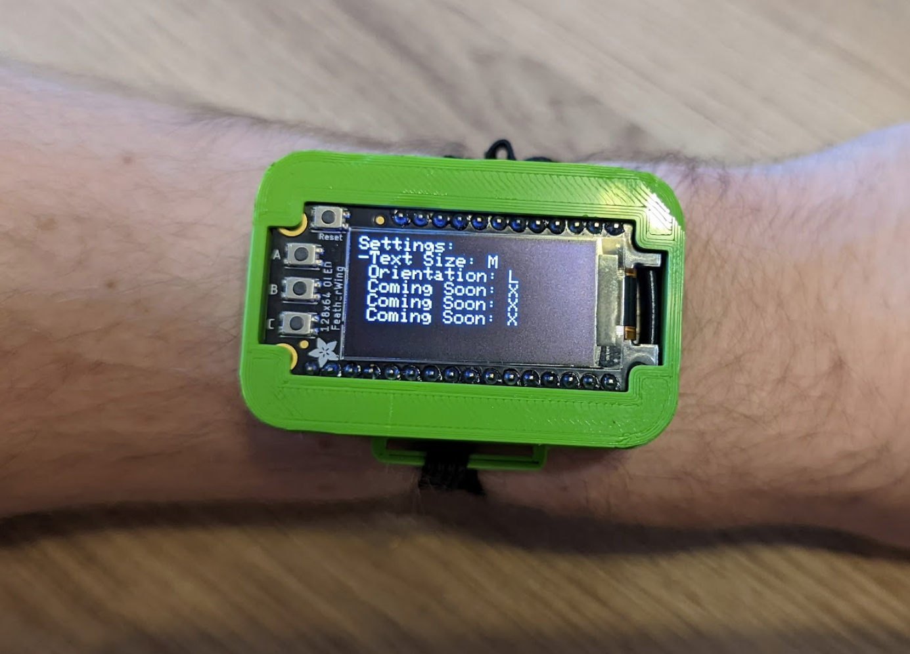

# DataRacer
### A Wrist-Mounted Data Logger for Race Car Drivers
###### By Chris Uustal | Fall '21 | CE395 - Wearables & Embedded Computing
## Executive Summary:
#### Motivation: Why am I doing this? 
I'm taking a class (duh). But actually, I'm a member of the Formula SAE team here
at Northwestern University, and we've spent years collecting data on our vehicle
while never collecting data on our drivers. I wanted to change that. 
#### Problem: What am I fixing? 
Collecting meaningful data from a driver is HARD. They need to wear a very particular
racing suit and the environment they are operating in is... less than forgiving. The
solution also has to be very user friendly and reliable, because if it isn't then
they just won't use it. 
#### Solution: How am I fixing it? 
I designed a smart watch platform capable of collecting and logging sensor data that
has a simple user interface, logs data to a removable microSD card, and can be easily
scaled to include whatever sensors are needed by the driver (whenever those sensors
are back in stock). 
#### Impact: The bigger picture 
The team spends thousands of hours every year trying to tune every ounce of performance 
out of our vehicle, but the driver is picked based off knowledge--not skill. If 
we can find meaningful ways to improve the skills of our drivers based off this data,
then that could make bigger improvements to the performance of our vehicle than some 
projects ever could. 
## Design: 
#### Visual Story

#### Hardware Block Diagram

#### What parts did I use? 
- ESP32 Feather by Adafruit
- OLED 128x64 FeatherWing by Adafruit
- MicroSD Breakout Board by Adafruit
- MPU6050 9DOF+Temp I2C Sensor (unknown vendor)
- 500mAh LiPoly Battery by Adafruit
#### Implementation
###### Hardware 
The decision was made early on to use parts that were as easy as possible to get working 
out of the box with as little tinkering as possible. Both Sparkfun and Adafruit have 
fantastic development platforms for this, so I arbitrarily chose Adafruit, since they both
appeared to have similar levels of hardware diversity. With that, I immediately began 
moving forward with the Adafruit ESP32 Huzzah feather and OLED 128x32 FeatherWing as my 
MCU and interface of choice. I've worked with the ESP32 previously and was quite happy 
with its performance and feature set, so I saw no reason to reinvent the wheel. The only
major downside of the ESP32 compared to alternative options is its high power draw, but
since this design was for prototyping only, I wasn't as concerned about battery life so 
long as it doesn't completely destroy the demo experience, which ended up being a good choice. 
The OLED 128x32 FeatherWing (which I later upgraded to the 128x64 variant) offered interface
buttons and a screen for displaying information to the user, so it checked all my interface 
requirements in one package. Since all featherWings are intended to be stacking shields 
directly on top of any feather MCU, I implemented it as such, directly stacking the display
ontop of the MCU even in the final package. Conventionally the two components would be spaced 
out by male headers on the OLED plugged into female headers from the ESP32, but this takes
up a lot of vertical space within my packaging, something which was already at a premium 
in the tiny form factor I was going for. As such, in the final build I actually soldered
both the ESP32 and OLED directly to the same pair of male headers, allowing them to be stacked 
together in a package nearly 0.25 inches shorter than with conventional stacking. The
buttons integrated into the OLED directly map to GPIO ports on the ESP32, and the OLED 
gets its display information over I2C. The OLED comes with a library and tutorial out of
the box, so it was up and running in no time. 
  
For the battery, Adafruit offers a selection of LiPoly batteries that are capable
of directly interfacing with and charging from the ESP32 feather, so I used the largest one
from their series capable of fitting into the footprint I ended up deciding on, 500mAh. I
originally worked with a 1200mAh battery, but this ended up being significantly larger than
was reasonable for a wrist-mounted device. 
  
The MicroSD card breakout that I used was the only one Adafruit offered, so since I'd already
had good luck on their other products, I simply continued using them as my vendor of choice. 
It included 5v to 3.3v level shifting, so while that made the package a little larger, it
also protected me in case I ended up wanting to use the breakout in another design later 
on (which I didn't end up doing, but that's fine). It interfaced over SPI, which is expected
for a MicroSD card, but it also offered some nice quality of life features like card detection
and an indicator LED when it's being written to. 
  
The only actual sensor in the device, the MPU6050 9DOF+Temp sensor I just happened to
have already in inventory, so I started testing with it originally just to have an example
sensor without the intention of actually including it in the final product. It isn't from
Adafruit and honestly I don't even know where I got it from, but it also operated off I2C 
and worked easily enough that I didn't ever have to worry about it. It was even small enough 
that it never presented any major packaging issues. 
  
I wanted to include a lot more sensors in the design, but part shortage issues as well as
some miscommunications with the university buying some sensors for me ended up making it 
more logically to just focus on developing the backbone system and leaving more sensors 
to the future development of the solution. 
###### Software
Given that the code base for this project is well into the thousands of lines, it would be 
impossible for me to walk through all of it. Instead, I'll just give a high level overview 
of what's going on. 
  
At startup, initialization functions for everything are called to ensure all the variables 
are properly initialized, timers are zero-ed to the current time, state machines are set
to their default state, and buttons are set to their default position. It also performs 
some preliminary checking to ensure all the devices its expecting are connected, and if not
then it makes sure to not bother trying to interface with those devices until they are connected
or the system is restarted. It also checks if an SD card is present and if the log file
is present on that SD card. If it isn't, then it creates a new one, but if it is, then it 
just opens then file and gets ready to write to it. It also does things like connect to the 
WiFi to get the current time. 
  
After this it launches into an infinite loop of sudo-virtual timers. Essentially, when I first
designed the system, everything was simply running in the main loop. Even once I broke it out 
to make calls to these functions modular, I still had every function running every iteration of 
the loop. This is generally a terrible approach, so I designed a system that keeps track of 
the last time a loop function was called and how long it should wait until it calls it again. 
This uses millis(), an Arduino function which returns the number of milliseconds since the 
code started running, and it rolls over every 52 days or so. This allowed me to execute certain
functions (such as my button handler) significantly more often than checking the battery or 
writing to the screen, since a slow button is easily noticeable but a slowly changing battery 
percentage is hardly noticeable. The implementation isn't perfect since currently it requires
you to manually add each new looping function in the code, but I didn't end up finding the
better approach of allowing the code to dynamically add and remove functions from the list
to be worth the effort it would take to implement it. This is also blocking, meaning if one task 
hangs then the whole loop hangs, but a non-blocking implementation would require ISRs which
are more complex and approaching RTOS levels of complexity, which I was attempting to avoid here. 
  
The display function is one of the larger components as it has to handle displaying all 
possible information to the user dynamically. This basically has one master function which
handles configuring and sending the data to the screen every frame, then there's a finite 
state machine which manages all the different screens and uses a switch statement to select 
between them, which are then broken out into a bunch of smaller helper functions. 
  
The button handler is another massive function which manages all the interactions the user can
have with the device. Specifically, the device comes with 3 buttons plus a reset. Since the user
should really never press reset unless they have to, this leaves us with 3 interface options. 
That's not a lot, so the button handler tracks when a button is pressed and un-pressed and 
can perform different actions based on the duration of the press. My particular implementation 
works based off a simple threshold where a button pressed less than 500ms performs a "short press" 
action and another beyond that performs a "long press" action. This lets the user do something
like put the device to sleep with a long press on A but toggle between screens with a short press
on A. This works off a massive struct with a bunch of internal functions that are being called 
every loop iteration. The final sample rate for the buttons is 20ms, but this worked without 
issue at 5ms and 40ms, so I think anything in this range works fine. I should note that, since 
certain functions like the stopwatch really depend on accurate timing, I also have a separate
function which executes when the button is pressed regardless of press duration, but I avoided
this in most cases since it reduces a button to only one function. Button actions are also tied
to the current FSM state of the display with a switch statement, so a short press on C (which 
I've informally dubbed primary interaction) when on the stopwatch screen will start/stop it, 
but on the logging screen it enables/disables logging, and a similar effect occurs for every screen. 
Again, there are better ways to implement this with interrupts, but this worked and was easy. 
  
The SD card functions are the last complicated part, but they also took the longest to debug 
and were the easiest to break. From a high level, the device starts up and checks if an SD 
card is physically present in the device. If so, then it attempts to interface with it. If that's
successful, it then checks if the log file exists on the SD card. If not, then it creates it
and puts the headers for the sensors being logged, but if it does, then it notes that a restart
was performed. Logging is disabled by default on startup, but if logging is enabled at startup, 
then it would immediately start logging all the sensor data at 100Hz. As a looping function, it 
continually checks if the SD card is present and if it should be logging data. If both of these
are true, then it logs data. If the card is present but it shouldn't be logging, then it does
nothing. If it notices that the card isn't present but it should be logging, it turns logging 
off to avoid attempting to and failing to write to the card. When it notices that a card goes
from not being inserted to being inserted, it attempts to run the setup function again to
allow the card to be connected and disconnected dynamically without powering the device off. 
However, to get the SD card to log this quickly without issue, I had to make some custom tweaks 
to the library. Particularly, the default SD library opens the file, adds the data you want to add, 
then closes the file for every bit of text you append. While this is very reliable, closing the 
file also takes ~6ms. This may not sound like much, but when we're logging 100x per second, that
quickly consumes 60% of our compute time just closing this SD file over and over. Instead of doing
that, I just open the file at startup and keep it open when logging data to it, only closing it 
when I stop logging. Because of this, if you eject the card in the middle of logging, the data
hasn't yet been fully properly saved to the card, meaning some data gets lost. To avoid this issue, 
I have a slower function running every second in the background that periodically closes and 
reopens the SD card file, saving all the data properly in the process while only wasting 6ms 
every second, which is way better! When the device goes to sleep it also closes and reopens 
the SD card just in case. 
  
The sleep function is fairly simple, but it's still very useful. Essentially, the ESP32 is such
a powerful chip that it can actually be put to sleep in a variety of different levels to save
increasingly more power. Lower levels are more inconvenient but come at reduced power consumption. 
Since I just wanted basic sleeping functionality and a moderate amount of power savings, I used
the lightest level of sleep, actually known as "light sleep," in which the ESP32 doesn't even
lose the state of its registers and can perfectly resume operation. This brings the chip down
from about 50mA to less than 1mA of current draw according to its datasheet, and that was good 
enough for these applications. To get this to work, all you have to do is call a specific
function that puts the ESP32 to sleep and configure a specific pin to wake the chip on a rising
or falling edge. With a little display animation as it goes to sleep and wakes up, the feature
was done. 
  
All other functions are fairly self-explanatory, but I'll give them each a quick overview:
- accel: it measures the magnitude of the current acceleration every 10ms as well as the maximum 
acceleration and lets you zero and un-zero this value dynamically. Does the same for temperature.
- battery: literally just checks the current voltage of the battery and does a rudimentary 
mapping of this value to an approximate percentage based off a chart on the internet. 
- fsm: just declares a few finite state machines which are used throughout the system, like the 
display, settings, and a few smaller ones. 
- RTC: connects to wifi and pings a server asking for the current time, then displays it back 
to the user. This isn't an actual RTC, but it can fake it with the onboard wifi. 
- settings: I started implementing a settings interface for the device near the end of the 
development cycle as it became clear that a user might want to tweak things themselves without
having to get their hands dirty in the code. It wasn't fully implemented since it ended up being
a lot more work than it was worth for a demo, but the template is there. 
- soc: daughter function set for battery. Honestly doesn't need to be its own file. 
- stopwatch: tracks a timer based on millis() that the user can start and pause dynamically. 
It could be used for tracking lap times or something like that, but a "lap" function was
never implemented. It changes formatting dynamically though to support up to 999 minutes. 
  
That's it. There's so much more to go into in the software for a true deep dive, but this should 
be enough to give a realistic fundamental understanding of how the entire code base works together. 
###### CAD 
The packaging quickly became clear once I'd finalized the components I was using. There were very
few ways to put the components together geometrically that made any sense, so I just picked one 
and started designing a housing. Because 3D printing is an easy way to iterate quickly on a design, 
it was the clear choice for the housing. I tried both ABS and PLA, and the higher durability of PLA 
made it a clearly better choice for my applications. Since 3D printing generally doesn't like
overhangs in the designs, I split then housing into two main parts called the lower and upper
housing that then could be press fit together. It also has an opening for accessing the microUSB
port and MicroSD card slot from within the housing beyond the obvious space for the display and button
user interfaces. In the final iteration, I also added small handles on the sides so a band 
could be attached to the device, allowing it to actually be mounted to one's wrist. Below is
a picture of the full CAD assembly without the lower housing (so you can see the intended packaging):
 

 
You can then compare that to the actual packaging I constructed: 
 

 
There were a few challenges and unknowns with the housing that meant I got up to 4 iterations
on the lower and 5 iterations on the upper, but they were fairly trivial to resolve with trial and
error. For example, I originally made the inner dimensions of the housing the exact outer dimensions
of the components, but plastic actually expands a little when you print it, so I had to increase my 
inner dimensions by a tiny bit to fit the components comfortably. Similarly, getting elements like
standoffs that mate to the mounting holes on the display as well as the wall thickness just right
took a few tries, but eventually it got to the current design which works well enough. 
#### Pictures
It would be better suited to a video, but here are some pictures of it in action: 
 
Acceleration: 
 

 
Temperature: 
 

 
Stopwatch: 
 

Clock: 
 

 
Battery Percentage: 
 

 
Logging: 
 

 
Settings: 
 

 
#### Lessons Learned
1. Once you've got a basic idea of the direction you want to go in, just start moving. 
The easiest way to run out of time and kill a design is by not giving yourself
as much time as possible with the hardware. The sooner you have it in your hands 
and either get something working or realize that it's way too hard and you need 
to change direction the better. The biggest thing that killed the momentum in this
project was waiting for components to be ordered that never arrived. Burn the money, 
but the components, get them here tomorrow and start working immediately. It's worth it. 
2. When you're coding, steal as much as possible. Someone else already did something 
kind of similar? Cool, don't reinvent the wheel. Build something cooler off the back 
of what they already did rather than wasting time doing the same thing. If you're 
writing official code for a company, that's something different, but the gloves come off 
when you're just prototyping alone, and the only goal is to produce something that works
as fast as possible by any means necessary. 
3. Always have multiple parts of a project that could use improvement--it avoids blockers. 
It might seem good to really focus in on one particular element of a project and polish 
it to completion, but that's terrible for prototyping, because sometimes things get stuck. 
Sometimes things don't work or they get stuck or you get frustrated or shipping takes 2 weeks. 
Rather than having nothing to do for that time, always have another direction to start
developing in, so when that blocker becomes unblocked you have something fresh to pivot back to. 
4. (If you really want to try this yourself) Packaging a wearable is *very* hard. 
Everyone you show it to is going to expect it to be this slim, tiny little magic device
that is *not* prototype friendly at all. What I have right now works fine, but if you want
to take this any further than I already have, then wait until after the global chip shortage, 
design a custom debug-friendly PCB, and then you might have something people will
actually want to look at. An 18mm thicc watch is *not* attractive. 
## Non-Class Things:  
#### Will I support this project? 
No, don't assume I will. I might update it in the future, and if so, cool! But 
I also might not, so don't hold your breath. 
#### Can you use this? 
Of course, everything is open source and you're free to use it for your own personal non-commercial
projects. If you want to use it to start a company or sell a product or something, shoot 
me a message and I'm sure we can work something out. 