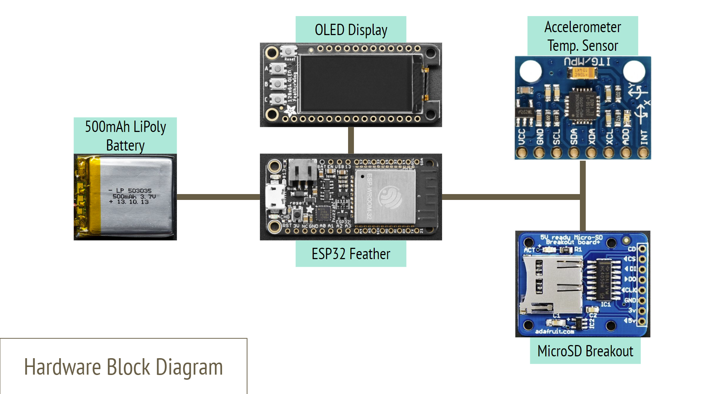

# DataRacer
### A Wrist-Mounted Data Logger for Race Car Drivers
###### By Chris Uustal | Fall '21 | CE395 - Wearables & Embedded Computing
## Executive Summary
#### Motivation: Why am I doing this? 
I'm taking a class (duh). But actually, I'm a member of the Formula SAE team here
at Northwestern University, and we've spent years collecting data on our vehicle
while never collecting data on our drivers. I wanted to change that. 
#### Problem: What am I fixing? 
Collecting meaningful data from a driver is HARD. They need to wear a very particular
racing suit and the environment they are operating in is... less than forgiving. The
solution also has to be very user friendly and reliable, because if it isn't then
they just won't use it. 
#### Solution: How am I fixing it? 
I designed a smart watch platform capable of collecting and logging sensor data that
has a simple user interface, logs data to a removable microSD card, and can be easily
scaled to include whatever sensors are needed by the driver (whenever those sensors
are back in stock). 
#### Impact: The bigger picture 
The team spends thousands of hours every year trying to tune every ounce of performance 
out of our vehicle, but the driver is picked based off knowledge--not skill. If 
we can find meaningful ways to improve the skills of our drivers based off this data,
then that could make bigger improvements to the performance of our vehicle than some 
projects ever could. 
## Design: 
#### Visual Story

#### Hardware Block Diagram

#### What parts did I use? 
- ESP32 Feather by Adafruit
- OLED 128x64 FeatherWing by Adafruit
- MicroSD Breakout Board by Adafruit
- MPU6050 9DOF+Temp I2C Sensor (unknown vendor)
- 500mAh LiPoly Battery by Adafruit
#### Implementation
###### Hardware 
The decision was made early on to use parts that were as easy as possible to get working 
out of the box with as little tinkering as possible. Both Sparkfun and Adafruit have 
fantastic development platforms for this, so I arbitrarily chose Adafruit, since they both
appeared to have similar levels of hardware diversity. With that, I immediately began 
moving forward with the Adafruit ESP32 Huzzah feather and OLED 128x32 FeatherWing as my 
MCU and interface of choice. I've worked with the ESP32 previously and was quite happy 
with its performance and feature set, so I saw no reason to reinvent the wheel. The only
major downside of the ESP32 compared to alternative options is its high power draw, but
since this design was for prototyping only, I wasn't as concerned about battery life so 
long as it doesn't completely destroy the demo experience, which ended up being a good choice. 
The OLED 128x32 FeatherWing (which I later upgraded to the 128x64 variant) offered interface
buttons and a screen for displaying information to the user, so it checked all my interface 
requirements in one package. Since all featherWings are intended to be stacking shields 
directly on top of any feather MCU, I implemented it as such, directly stacking the display
ontop of the MCU even in the final package. Conventionally the two components would be spaced 
out by male headers on the OLED plugged into female headers from the ESP32, but this takes
up a lot of vertical space within my packaging, something which was already at a premium 
in the tiny form factor I was going for. As such, in the final build I actually soldered
both the ESP32 and OLED directly to the same pair of male headers, allowing them to be stacked 
together in a package nearly 0.25 inches shorter than with conventional stacking. The
buttons integrated into the OLED directly map to GPIO ports on the ESP32, and the OLED 
gets its display information over I2C. The OLED comes with a library and tutorial out of
the box, so it was up and running in no time. 
 
For the battery, Adafruit offers a selection of LiPoly batteries that are capable
of directly interfacing with and charging from the ESP32 feather, so I used the largest one
from their series capable of fitting into the footprint I ended up deciding on, 500mAh. I
originally worked with a 1200mAh battery, but this ended up being significantly larger than
was reasonable for a wrist-mounted device. 
 
The MicroSD card breakout that I used was the only one Adafruit offered, so since I'd already
had good luck on their other products, I simply continued using them as my vendor of choice. 
It included 5v to 3.3v level shifting, so while that made the package a little larger, it
also protected me in case I ended up wanting to use the breakout in another design later 
on (which I didn't end up doing, but that's fine). It interfaced over SPI, which is expected
for a MicroSD card, but it also offered some nice quality of life features like card detection
and an indicator LED when it's being written to. 
 
The only actual sensor in the device, the MPU6050 9DOF+Temp sensor I just happened to
have already in inventory, so I started testing with it originally just to have an example
sensor without the intention of actually including it in the final product. It isn't from
Adafruit and honestly I don't even know where I got it from, but it also operated off I2C 
and worked easily enough that I didn't ever have to worry about it. It was even small enough 
that it never presented any major packaging issues. 
###### Software

###### CAD 

#### Pictures
Still need to figure out how to add a picture lol
#### Lessons Learned
1. Once you've got a basic idea of the direction you want to go in, just start moving. 
The easiest way to run out of time and kill a design is by not giving yourself
as much time as possible with the hardware. The sooner you have it in your hands 
and either get something working or realize that it's way too hard and you need 
to change direction the better. The biggest thing that killed the momentum in this
project was waiting for components to be ordered that never arrived. Burn the money, 
but the components, get them here tomorrow and start working immediately. It's worth it. 
2. When you're coding, steal as much as possible. Someone else already did something 
kind of similar? Cool, don't reinvent the wheel. Build something cooler off the back 
of what they already did rather than wasting time doing the same thing. If you're 
writing official code for a company, that's something different, but the gloves come off 
when you're just prototyping alone, and the only goal is to produce something that works
as fast as possible by any means necessary. 
3. Always have multiple parts of a project that could use improvement--it avoids blockers. 
It might seem good to really focus in on one particular element of a project and polish 
it to completion, but that's terrible for prototyping, because sometimes things get stuck. 
Sometimes things don't work or they get stuck or you get frustrated or shipping takes 2 weeks. 
Rather than having nothing to do for that time, always have another direction to start
developing in, so when that blocker becomes unblocked you have something fresh to pivot back to. 
4. (If you really want to try this yourself) Packaging a wearable is *very* hard. 
Everyone you show it to is going to expect it to be this slim, tiny little magic device
that is *not* prototype friendly at all. What I have right now works fine, but if you want
to take this any further than I already have, then wait until after the global chip shortage, 
design a custom debug-friendly PCB, and then you might have something people will
actually want to look at. An 18mm thicc watch is *not* attractive. 
## Non-Class Things:  
#### Will I support this project? 
No, don't assume I will. I might update it in the future, and if so, cool! But 
I also might not, so don't hold your breath. 
#### Can you use this? 
Of course, everything is open source and you're free to use it for your own personal non-commercial
projects. If you want to use it to start a company or sell a product or something, shoot 
me a message and I'm sure we can work something out. 